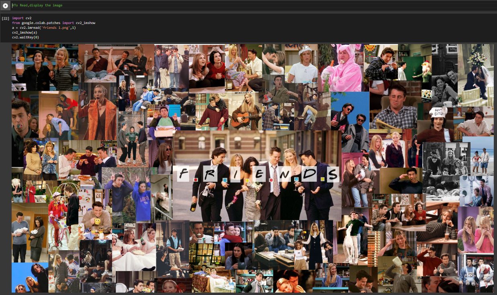
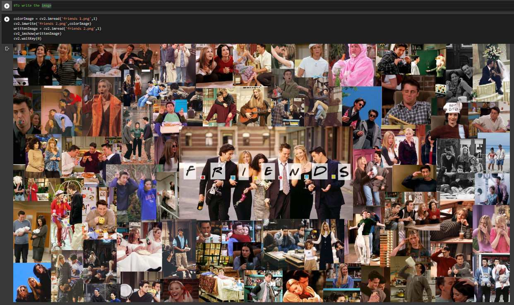
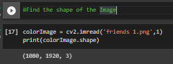
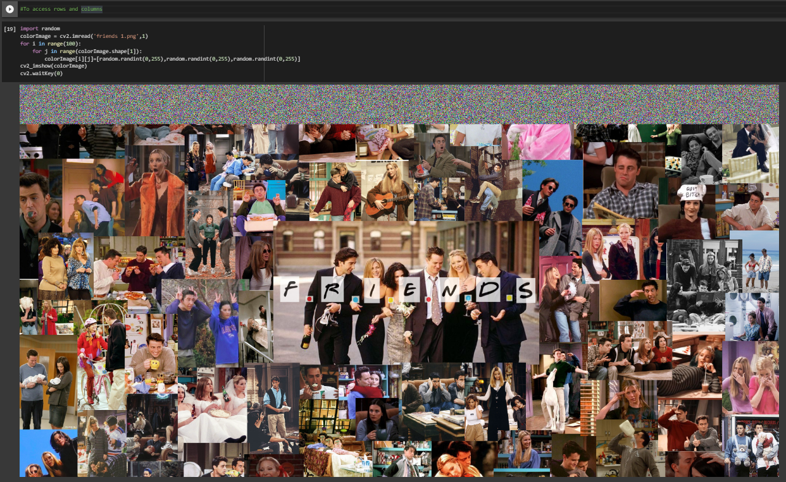
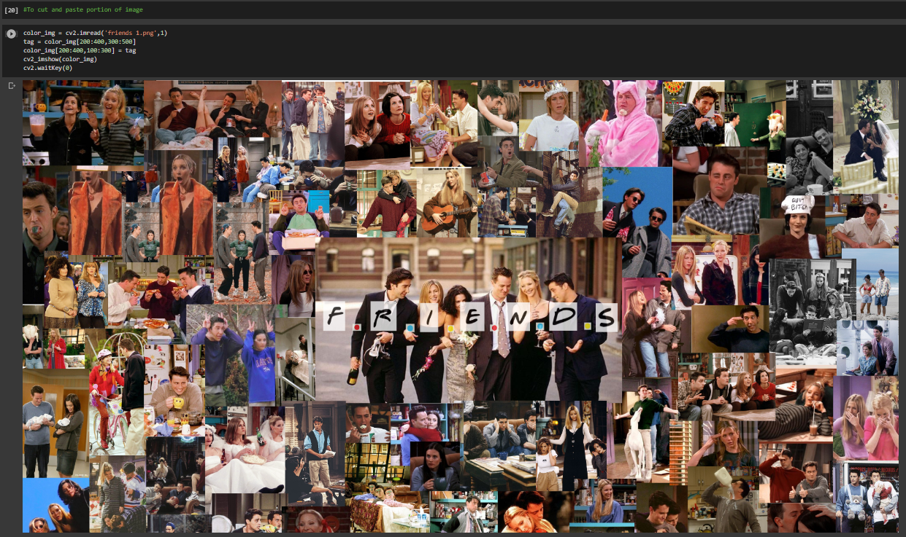

# READ AND WRITE AN IMAGE
## AIM:
To write a python program using OpenCV to do the following image manipulations.
i) Read, display, and write an image.
ii) Access the rows and columns in an image.
iii) Cut and paste a small portion of the image.

## SOFTWARE REQUIRED:
Anaconda - Python 3.7
## ALGORITHM:
### Step1:
Choose an image and save it as a filename.jpg
### Step2:
Use imread(filename, flags) to read the file.
### Step3:
Use imshow(window_name, image) to display the image.
### Step4:
Use imwrite(filename, image) to write the image.
### Step5:
End the program and close the output image windows.
## PROGRAM:
### Program developed by : Shrruthilaya G
### Register number : 212221230097 

i) To read and display the image
```
import cv2
from google.colab.patches import cv2_imshow
a = cv2.imread('friends 1.png',1)
cv2_imshow(a)
cv2.waitKey(0) 

```
ii) To write the image
```
colorImage = cv2.imread('friends 1.png',1)
cv2.imwrite('friends 2.png',colorImage)
writtenImage = cv2.imread('friends 2.png',1)
cv2_imshow(writtenImage)
cv2.waitKey(0)

```
iii) To find the shape of the Image
```
colorImage = cv2.imread('friends 1.png',1)
print(colorImage.shape)
```
iv) To access rows and columns

```
import random
colorImage = cv2.imread('friends 1.png',1)
for i in range(100):
    for j in range(colorImage.shape[1]):
        colorImage[i][j]=[random.randint(0,255),random.randint(0,255),random.randint(0,255)]
cv2_imshow(colorImage)
cv2.waitKey(0)
```
v) To cut and paste portion of image
```
color_img = cv2.imread('friends 1.png',1)
tag = color_img[200:400,300:500]
color_img[200:400,100:300] = tag
cv2_imshow(color_img)
cv2.waitKey(0)
```

## Output:

### i) Read and display the image


### ii)Write the image


### iii)Shape of the Image

### iv)Access rows and columns

### v)Cut and paste portion of image

## Result:
Thus the images are read, displayed, and written successfully using the python program.


